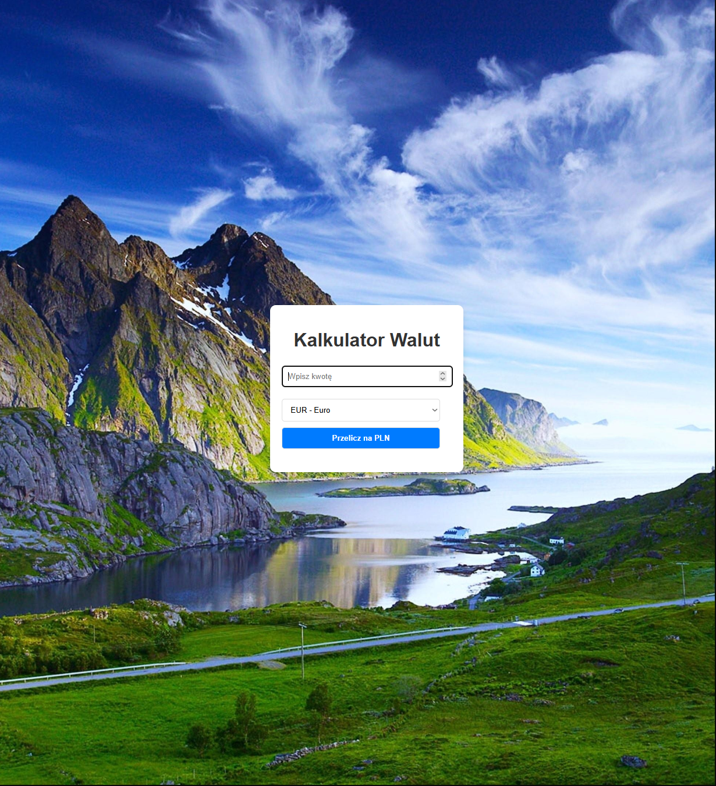

# Currency Converter React App

_A simple and responsive currency converter app built with React. This app allows users to quickly convert between multiple currencies using real-time exchange rates. It features a clean UI, intuitive design, and seamless performance_

## About

A simple yet powerful currency converter built with React and styled-components.

## Demo

You can view the live demo of the application here:

- [Demo on GitHub Pages](https://antonis04.github.io/CurrencyConverterReact/)

## Features

- Real-time currency conversion
- Up-to-date exchange rates via currencyapi.com
- Responsive design
- Error handling

## Technologies

- React
- styled-components
- API integration

## Installation

1. Clone the repository
2. Install dependencies: `npm install`
3. Start the development server: `npm start`

## API

This project uses the [currencyapi.com](https://currencyapi.com/) API for currency exchange rates.
